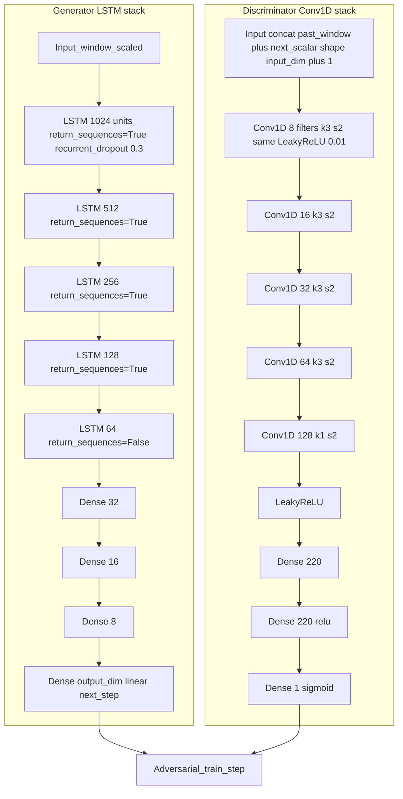
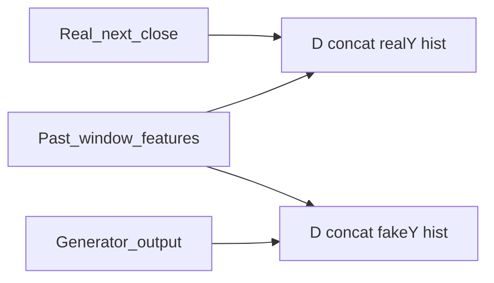
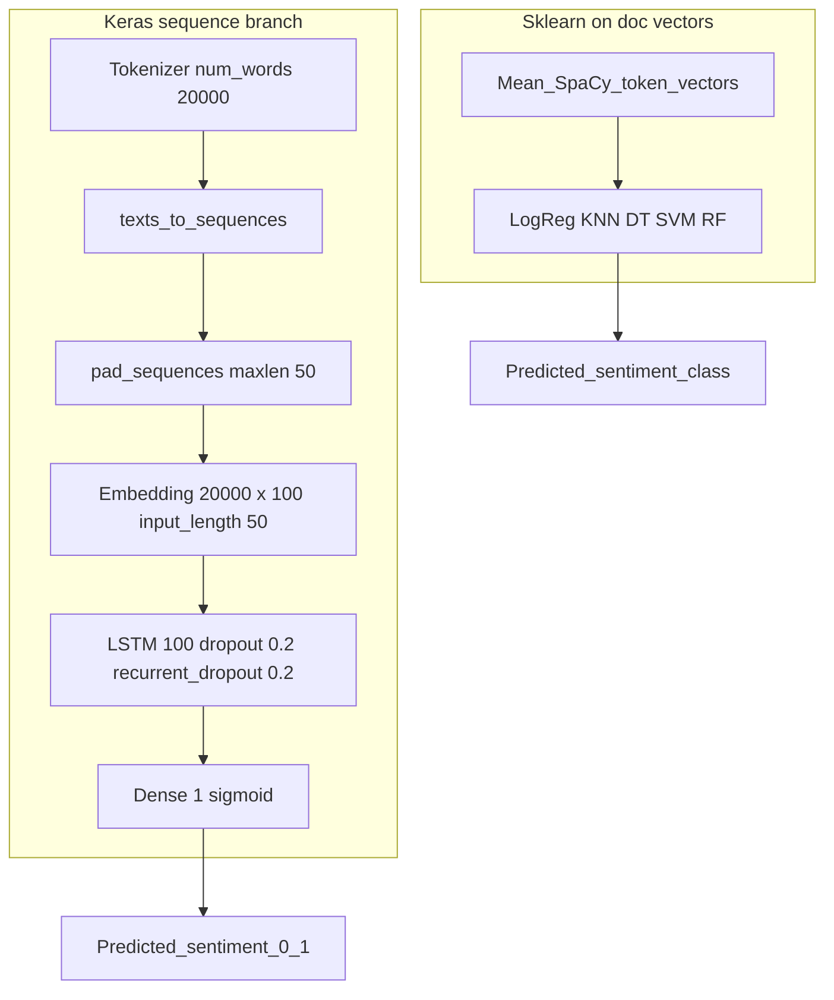
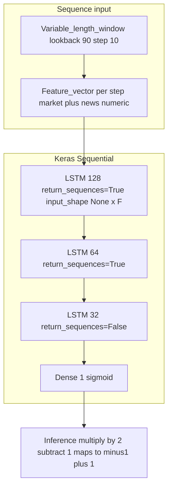
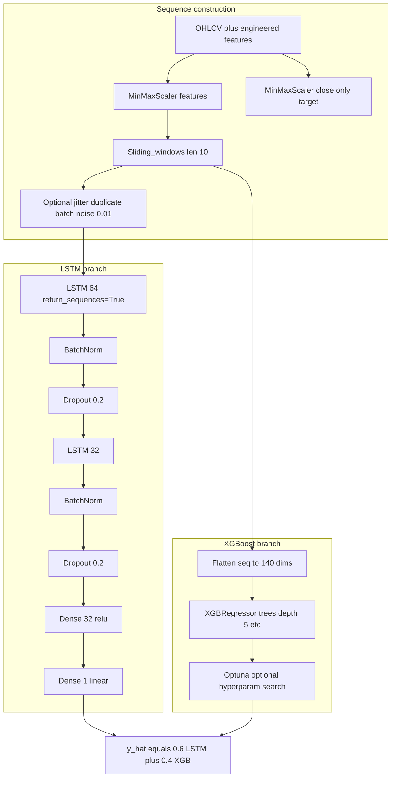
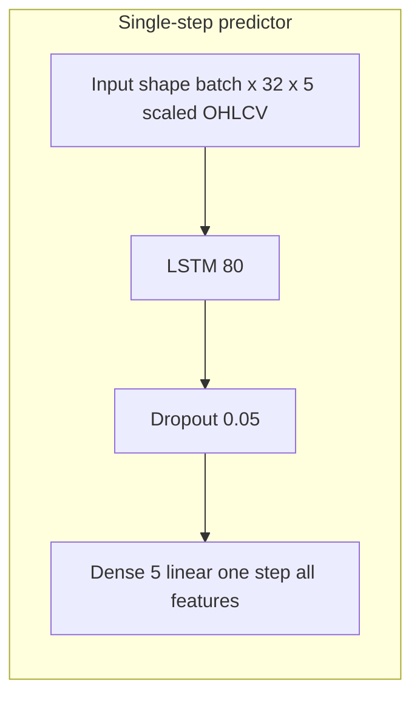
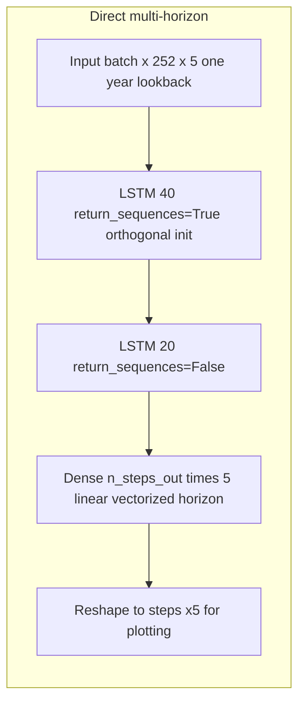
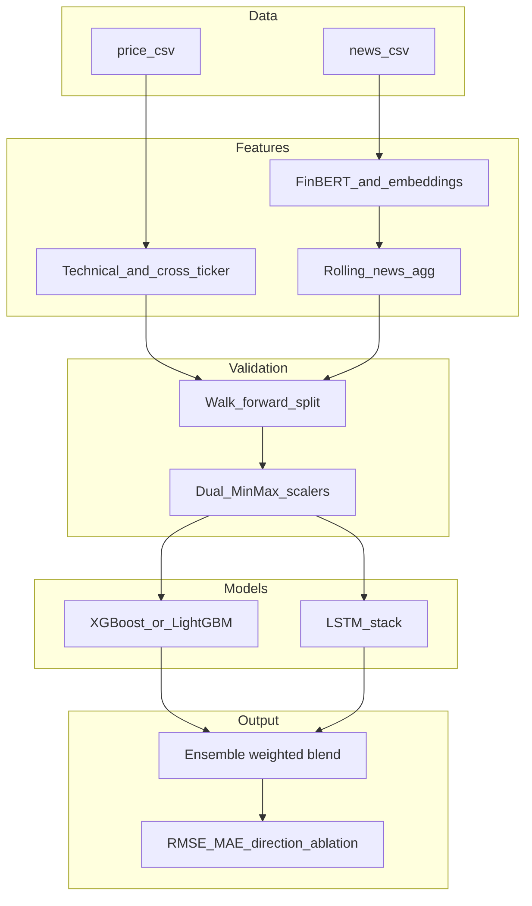

# State-of-the-Art Research: Stock Price Prediction with News Sentiment

This document reviews top Kaggle notebooks and community approaches for stock prediction that combine OHLCV data with news or sentiment. Findings inform the design of [`stock_prediction.ipynb`](stock_prediction.ipynb).

**Sources analyzed:** five high-vote Kaggle notebooks (~1,100 community votes combined), covering GAN, LSTM, XGBoost, hybrid, and multi-step setups.

---

## 1. Analyzed notebooks

| # | Notebook | Votes | Model | NLP method | Horizon |
|---|----------|-------|-------|------------|---------|
| 1 | [Stock Prediction GAN + Twitter Sentiment](https://www.kaggle.com/code/equinxx/stock-prediction-gan-twitter-sentiment-analysis) | 447 | Conditional GAN (LSTM generator + Conv1D discriminator) | VADER (NLTK) | Next-day |
| 2 | [News Sentiment Based Trading Strategy](https://www.kaggle.com/code/shtrausslearning/news-sentiment-based-trading-strategy) | 143 | LogReg, SVM, RF, LSTM text classifier | Custom VADER, TextBlob, SpaCy embeddings | Event return (analysis) |
| 3 | [EDA and LSTM with Generator for Market and News](https://www.kaggle.com/code/dmitrypukhov/eda-and-lstm-with-generator-for-market-and-news) | 270 | 3-layer LSTM (128-64-32) | Pre-computed sentiment columns (no raw NLP) | 10-day direction |
| 4 | [XGBoost + LSTM for Netflix Stock](https://www.kaggle.com/code/mehmetakifciftci/xgboost-lstm-for-netflix-stock) | 75 | XGBoost + LSTM hybrid (0.6 / 0.4) | None (price-only) | Next-day |
| 5 | [Tesla Stock Forecasting Multi-Step Stacked LSTM](https://www.kaggle.com/code/guslovesmath/tesla-stock-forecasting-multi-step-stacked-lstm) | 151 | Stacked LSTM (40-20) | None (price-only) | Multi-step (10 days in code) |

---

## 2. Detailed analysis per notebook

### 2.1 GAN + Twitter sentiment (447 votes)

**Data:** Twitter stock tweets (per ticker) + Yahoo Finance OHLCV.

**NLP:** VADER per tweet; daily `groupby(date).mean()`; left-join to prices; `ffill()` for missing sentiment days.

**Price features:** MA(7,20), MACD, Bollinger (20), EMA, momentum; drop first 20 rows; `MinMaxScaler(-1, 1)` on all columns together.

**Training:** Adam 5e-4, 500 epochs, batch size 5, `predict_period=1`. Last 20 batches held out.

**Conditional GAN idea:** The discriminator sees **past window + candidate next value** (real next close vs generator output), so it learns whether the proposed step is plausible given history.

#### Neural architecture (Mermaid)

**Training loop (conceptual):**

**Takeaways:** Strong generator capacity vs small data (overfitting risk); VADER is a weak financial signal; conditional D is the main modeling idea worth remembering.

---

### 2.2 News sentiment trading strategy (143 votes)

**Data:** yfinance (12 tickers), RSS/HTML headlines, expert labels, custom financial lexicon.

**Models:** Classical ML on **mean SpaCy token vectors** (LR, KNN, DT, SVM, RF); separate **Keras LSTM** on padded token ids for **binary sentiment** (not direct price regression).

#### LSTM text classifier (Mermaid)

**Note:** `eventRet` (same-day return + previous-day return) is used for **scatter plots and correlation** vs sentiment, not as the LSTM target.

**Takeaways:** Custom VADER lexicon + expert labels + transfer to unlabeled headlines; random 90/10 split is **not** ideal for time series.

---

### 2.3 LSTM market + news (Two Sigma, 270 votes)

**Data:** Competition `market` + `news` tables; **no raw text** — numeric sentiment columns + rolling 10-day mean per asset.

**Input per timestep:** `StandardScaler` features = market numerics + calendar + **joined news numerics** (missing news → 0 after left join).

**Label:** `sign(returnsOpenNextMktres10)` → binary; loss: `binary_crossentropy`. Inference: `sigmoid * 2 - 1` for submission confidence.

#### Stacked LSTM (Mermaid)

**Callbacks:** `EarlyStopping(patience=5)`, `ReduceLROnPlateau(factor=0.1, patience=2)`.

**Takeaways:** Per-asset batches preserve time order; rolling news aggregates help sparse events; direction classification vs regression.

---

### 2.4 XGBoost + LSTM hybrid — Netflix (75 votes)

**Data:** NFLX OHLCV only. Isolation Forest removes outliers before features.

**Sequences:** length 10, 14 features per step → LSTM sees `(batch, 10, 14)`; XGBoost sees **flattened** `(batch, 140)`.

**Dual scalers:** one `MinMaxScaler` on **Close** (target), one on the 14 input columns.

#### Parallel branches + ensemble (Mermaid)

**Takeaways:** 0.6/0.4 weighting; jitter + dual scaling; Optuna tuned on test in original notebook (methodological caveat).

---

### 2.5 Tesla multi-step stacked LSTM (151 votes)

**Data:** yfinance TSLA; **only** scaled OHLCV (5 channels) — no extra indicators.

**Two strategies in one repo:**

1. **Vanilla:** single-step LSTM, **recursive** multi-step at inference (roll window forward).
2. **Direct multi-step:** one forward pass outputs `n_steps_out * 5` values (e.g. 10 days × 5 features).

#### Vanilla single-step LSTM (Mermaid)

#### Direct multi-step stacked LSTM (Mermaid)

**Training:** multi-step uses MSE on full vector; batch size 1024; vanilla uses MAE.

**Takeaways:** Long lookback (252) for multi-step; direct output avoids error compounding vs recursion; orthogonal init on first LSTM.

---

## 3. Cross-notebook comparison

### 3.1 NLP / sentiment

| Approach | Used by | Strengths | Weaknesses |
|----------|---------|-----------|------------|
| VADER vanilla | Notebook 1 | Fast, no training | Weak on finance jargon |
| VADER + custom lexicon | Notebook 2 | Domain-tuned | Still lexicon-based |
| TextBlob | Notebook 2 | Trivial API | Low quality |
| SpaCy mean vectors + sklearn | Notebook 2 | Semantic | Needs labels for best results |
| Pre-computed numeric news | Notebook 3 | Scalable | No raw-text nuance |
| **FinBERT (our pipeline)** | — | Context, finance pre-training | Heavier compute |

### 3.2 Model types vs our adoption

| Type | Notebook | Best for | Our plan |
|------|----------|----------|----------|
| GAN | 1 | Synthetic sequences | Skip at our scale |
| Classical on embeddings | 2 | Sentiment classification | Reference only |
| 3-layer LSTM classifier | 3 | Direction | Smaller LSTM variant |
| LSTM + XGBoost | 4 | Tabular + temporal | **Primary hybrid** |
| Stacked multi-step LSTM | 5 | Multi-day horizon | Optional extension |

### 3.3 Feature engineering matrix

(Same as prior doc: MA, RSI, MACD, Bollinger, momentum, volatility, calendar, cross-ticker, sentiment, embeddings, news volume — our pipeline aims to cover the union.)

### 3.4 Validation

Walk-forward validation is **not** used in these five notebooks; it remains the recommended approach for our time-series setup.

---

## 4. Techniques to adopt

- **Dual scalers** — separate target vs feature `MinMaxScaler`.
- **Jitter** — Gaussian noise on LSTM inputs for small *n*.
- **Outliers** — Isolation Forest and/or quantile clipping.
- **Rolling news** — 5–10 day mean of sentiment-derived features.
- **Ensemble** — start `0.6 * LSTM + 0.4 * XGB`, tune on validation only.
- **Per-asset batches** — avoid shuffling unrelated tickers inside one LSTM batch.
- **SHAP** — `TreeExplainer` on boosting models.
- **Orthogonal init** — first LSTM layer when stacking.

---

## 5. How our approach differs

| Aspect | Typical Kaggle pattern | Ours |
|--------|------------------------|------|
| Sentiment | VADER / rules | FinBERT + sentence embeddings |
| Validation | Hold-out or random split | Walk-forward |
| Features | Few indicators | Broad technical + NLP + cross-ticker |
| News timing | Date-only join | Hour-aware mapping to trading day |

---

## 6. Risks and mitigations

| Risk | Mitigation |
|------|------------|
| Small *n* per ticker | Regularization, jitter, ensemble, walk-forward |
| Hard naive baseline | Report directional accuracy + ablations |
| Noisy news | Rolling sentiment, `has_news`, FinBERT |
| Leakage | Strict time ordering; tune on val not test |
| Slow FinBERT | Batch inference, cache once |

---

## 7. Our target pipeline (Mermaid)

---

## 8. References

1. Yukhymenko, H. (2022). *Stock Prediction GAN + Twitter Sentiment Analysis*. Kaggle. https://www.kaggle.com/code/equinxx/stock-prediction-gan-twitter-sentiment-analysis  
2. Shtrauss, A. (2025). *News Sentiment Based Trading Strategy*. Kaggle. https://www.kaggle.com/code/shtrausslearning/news-sentiment-based-trading-strategy  
3. Pukhov, D. (2018). *EDA and LSTM with Generator for Market and News*. Kaggle. https://www.kaggle.com/code/dmitrypukhov/eda-and-lstm-with-generator-for-market-and-news  
4. Cifci, A. (2025). *XGBoost LSTM for Netflix Stock*. Kaggle. https://www.kaggle.com/code/mehmetakifciftci/xgboost-lstm-for-netflix-stock  
5. GusLovesMath. (2024). *Tesla Stock Forecasting Multi-Step Stacked LSTM*. Kaggle. https://www.kaggle.com/code/guslovesmath/tesla-stock-forecasting-multi-step-stacked-lstm  
6. Araci, D. (2019). *FinBERT: Financial Sentiment Analysis with Pre-Trained Language Models*. arXiv:1908.10063.  
7. Oliveira, N. et al. (2017). *The impact of microblogging data for stock market prediction*. Expert Systems with Applications.
